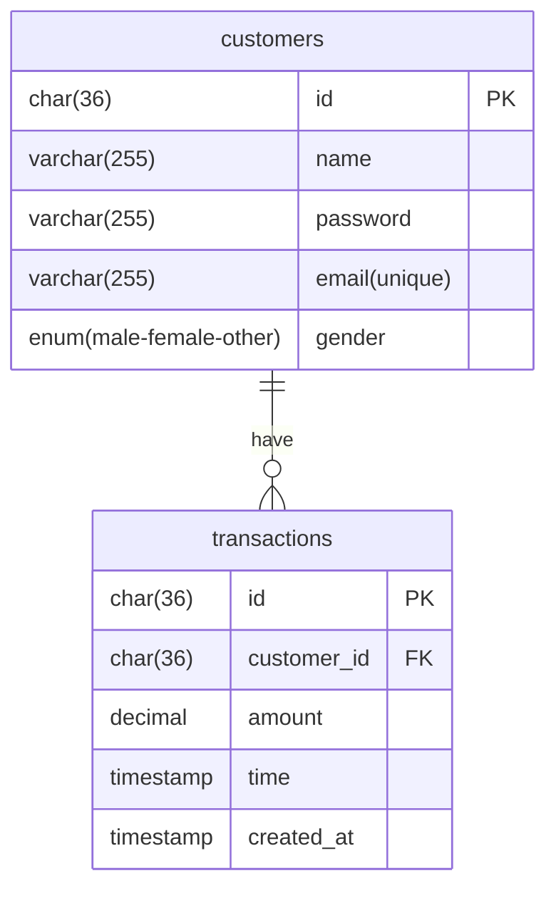
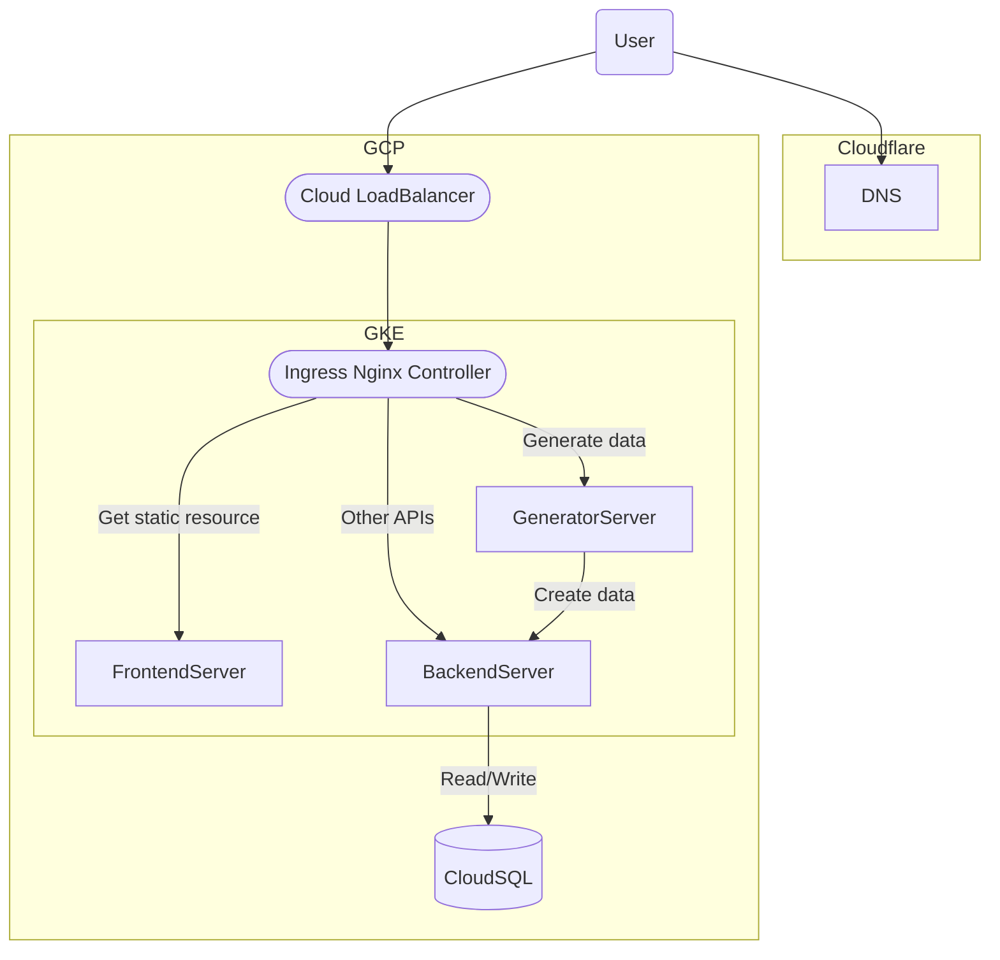

# Titansoft-pre-test

## 網址
```
https://pre-test.davidliao.net/
```

## 功能

1. 檢視客戶列表(顯示總數)
2. 新增客戶
3. 查看客戶詳細資訊
4. 編輯客戶詳細資訊
5. 查看特定客戶交易紀錄(顯示總數)
6. 以日期篩選客戶交易紀錄(隨日期顯示總數)
7. 客戶資料產生器-可自行輸入數量
8. 交易資料產生器-可自行輸入數量與分佈的客戶數量
9.  一鍵清除所有資料

## 說明

- 我將網站切分成三個容器化的微服務(Frontend Server、Backend Server、Generator Server)
- Frontend Server負責回傳前端靜態資源，資料夾位置：```/code/frontend```
- Backend Server負責接收大部分API以及讀寫DB，資料夾位置：```/code/backend/server```
- Generator Server負責產生資料並將產生的資料送給Backend Server，資料夾位置：```/code/backend/generator```
- 沒有在DB定義一個欄位用於第幾次消費，而是在後端以交易時間計算是第幾次消費，避免交易時間與第幾次消費衝突
- CI/CD透過Cloud Build實現，可參考/cloudbuild-*.yaml(皆有在Cloud Build Trigger設定相對應的文件被更新才觸發)
- 服務部署於GKE，DB使用CloudSQL，Ingress Controller使用Ingress NGINX Controller
- k8s Manifest文件可參考/pre-test-deploy.yaml
- 注:若要在本地端用docker-compose執行，需將nginx.conf中的window._config替換為：
```
SERVER_BASE_URL: "http://localhost:8080",
GENERATOR_BASE_URL: "http://localhost:8081"
```

## Entity-Relationship Diagram



## Architecture Diagram

